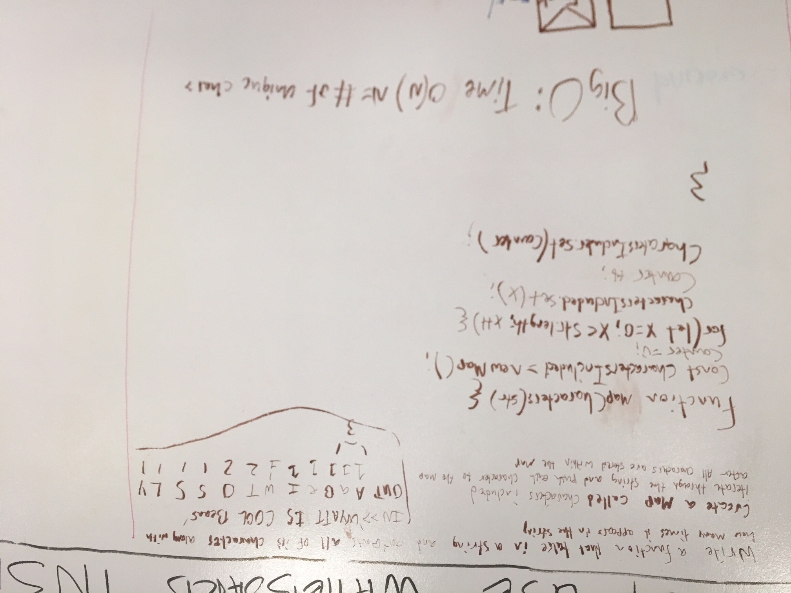

# Code Challenge
 - Write a function that takes in a string and returns every character used and how many times they appear.
# Build Status: 
 # Solution:
 
 idk this is flipping the picture upside down....
