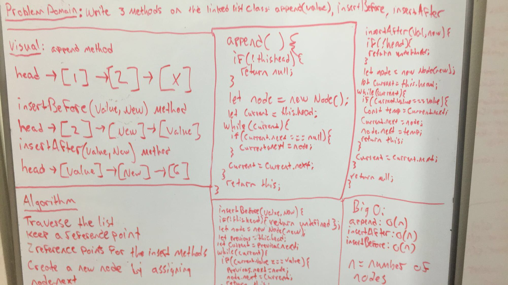

# Linked List Insertions
***
Last minute bug in test suite, will be fixed ASAP!!!
***
In this challenge we were asked to trite 3 methods on the Linked list class

```append(value)``` which adds a new node to the end of the list

```insertBefore(value, newValue)``` inserts a new value before the specified value.

- &

```insertAfter(value, newValue)``` inserts a new value after specified value


## Solution
